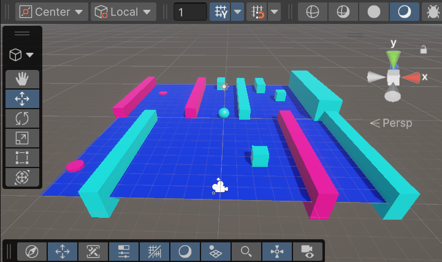
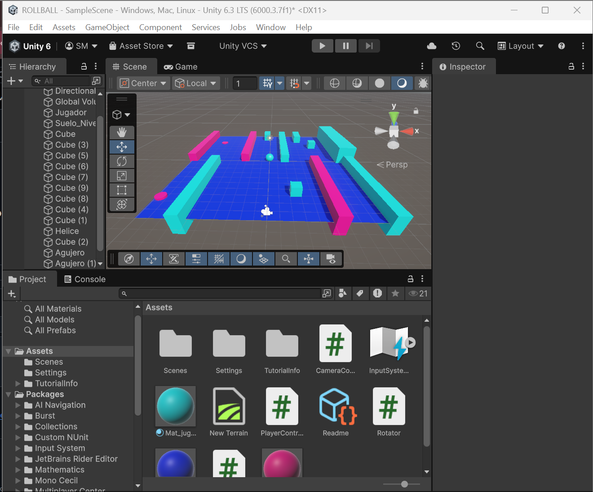

# PELOTA UNITY 🥣

>[!NOTE]
>***Simple juego basado en una pelota que interactúa con otros objetos colisionando o realizando varios eventos.***

---

# CARACTERÍSTICAS 

>[!CAUTION]
>***Uso de formas básicas, cubos, cilindros... para craer laberintos, obstáculos, alturas...***

- ***OBSTÁCULOS DINÁMICOS: Hélices giratorias en forma de cubo alargado***
- ***SISTEMA DE PORTALES: Uso de cilindros como agujeros negros que te teletransportan a un endpoint ( un ubicación distinta a la de la colision con estos )***
- ***CONTROLES: Para mover el player utilizamos W, A, S ,D...***
- ***SISTEMA: Physics (Con esto me refiero al uso de Rigibody)***

